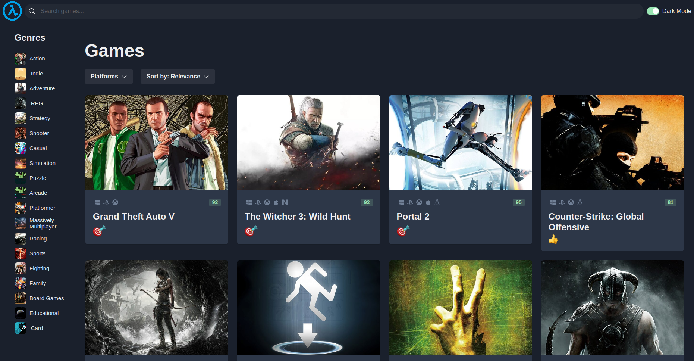

# Game Display

> This project is a fully responsive website clone of the [rawg](https://rawg.io/) website. This project makes use of their API.

## Built With
- React
- Typescript
- zustand
- chakra ui
- tailwind css

## See Live
[Click here](https://game-display.netlify.app/)

## Screenshot


## Getting Started

**To get this project set up on your local machine, follow these steps:**

1. Open Terminal.
2. Navigate to your desired location to download the contents of this repository.
3. Run  
```
git clone git@github.com:Tchilo/game-display.git
```
4. Run
  ```
  cd game-display
  ```
5. Run 
```
npm install` or `npm i
```
6. Run 
```
npm run dev
``` 

## Author:
  
 👤 **Taro Chilongoshi**

[<code></code>](https://github.com/tchilo)
[<code></code>](https://www.linkedin.com/in/taro-chilongoshi/)
 <a href="mailto:tchiloross@gmail.com?subject=Hey Taro?"></a>

## 🤝 Contributing

Contributions, issues and feature requests are welcome!

## Show your support

Give a ⭐️ if you like this project!
